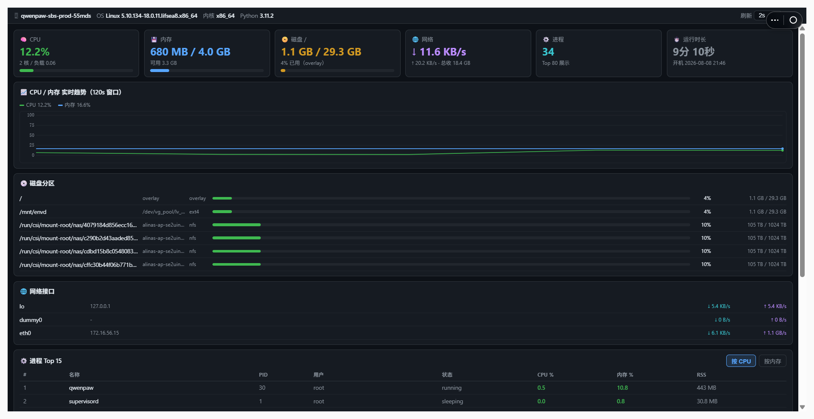

# 📊 资源监控（qwenpaw-resource-monitor）

QwenPaw 本地资源视图插件：实时展示**服务器本地资源占用**，纯只读监控。

应用启动入口：**应用 → 资源监控 📊**



## 功能

- **概览卡片**：CPU / 内存 / 磁盘（根分区）/ 网络速率 / 进程数 / 运行时长，一眼看全
- **实时折线图**：CPU + 内存 2 分钟趋势（canvas 自绘，不依赖外部图表库）
- **磁盘分区**：每个分区进度条 + 容量（已排除 proc/sysfs 等伪文件系统）
- **网络接口**：各接口 IP + 实时收发速率（↓ ↑）
- **GPU 监控**：自动探测 nvidia-smi，有 N 卡才显示（利用率 / 显存 / 温度）
- **进程 Top 榜**：Top 15，点击表头切换按 CPU / 内存排序
- **系统信息**：主机名 / OS / 内核 / Python 版本 / 开机时间
- **刷新间隔**：1s / 2s / 5s / 10s / 暂停

## 技术说明

- 后端 **psutil**（纯 Python，零系统包依赖），CPU 使用率用 `cpu_times` 差值计算
  （非阻塞），网络速率用字节计数器差值 / 时间差
- 只读插件，仅申请 `workspace.read` 权限，**不做任何写操作**
- 接口：
  - `GET /api/qwenpaw-resource-monitor/status` — 版本 / 运行时长
  - `GET /api/qwenpaw-resource-monitor/snapshot` — 全量资源快照
    （system / cpu / mem / disk / net / procs / gpu）

## 安装升级

1. 从插件市场安装本插件（或 `qwenpaw plugin install ./qwenpaw-resource-monitor --force` 热装）
2. **安装后刷新页面**（新插件 JS 注册路由需要刷新一次生效）
3. 打开入口：**应用 → 资源监控 📊**

升级：直接在插件市场更新到新版本，或重新热装覆盖，刷新页面即可。

## 目录结构

```
qwenpaw-resource-monitor/
├── plugin.json   # 清单：身份 / 版本 / 入口 / 菜单 / 权限
├── plugin.py     # 后端：psutil 采集 + snapshot 接口
├── ui/index.js   # 前端：React 组件（宿主内置 React）
├── CHANGELOG.md  # 变更记录
├── LICENSE       # Apache-2.0
└── .gitignore
```

## 安全

- 只读监控，无上传 / 删除 / 写文件能力
- GPU 探测子进程 2s 超时，失败静默降级
- 进程名 / 用户名校验截断，不返回完整命令行（避免泄露敏感参数）

## 变更记录

见 [CHANGELOG.md](./CHANGELOG.md)。

## 已知限制

- 浏览器缓存可能导致升级后仍显示旧界面：用无痕窗口或强制刷新（Ctrl+Shift+R）
- CPU/内存百分比为请求间隔采样值，首次打开前 1-2 秒数据为 0（差值算法预热）
- 进程列表仅展示 Top 80（按 CPU），如需全部进程可用终端插件查询
